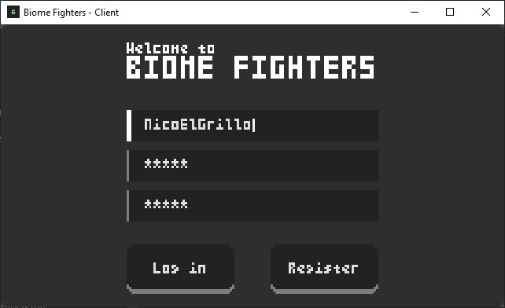
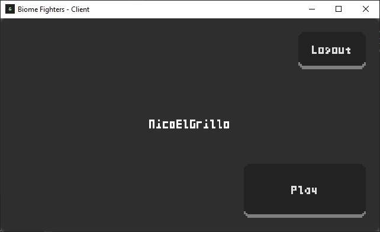
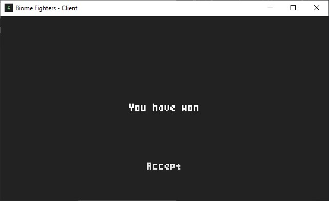

# Biome Fighters

## Overview
Biome Fighters is a 1v1 online multiplayer platform fighter game with a retro aesthetic, where there are more than just two platforms and *every corner is an opportunity for the victory*. It is inspired in [Spelunky's deatchmath](), but taken to a competitive online multiplayer enviroment.

Please note that the current version is prototype, so a lot of [initial ideas for the game](#ideas-for-the-game) are not implemented. It only includes a minimal playable experience in a map with some platforms, with one biome (the desert) and one character (the cactus).

### Tech stack
- **Aseprite** for the graphics.
- **Godot Engine** for the client and for the match synchronization.
- **Python** and **FastAPI** for the backend.
- **MongoDB Atlas** for the database.
- **GCP**'s Compute Engine for the deployment (*running live right now!*).

### Screenshots






## Getting Started
To try out the game, call a friend or anyone else to play with and both of you download the client executable (for either Windows or Android) from the [releases](). After that, just hit the play button and try to beat each other!

If you want to run the game server locally for development, see below on the [contributions](#how-to-run-locally) section 

## Contributions
Contributions are not being actively sought at the moment, as the game is not expected to undergo significant development. 

However, if you are interested in the project, feel free to continue it by your own. Below I leave some resources to help you in case you want to expand it.

*(And don't forget to tell me if you do, as I would be very curious to see how the game evolves!)*

### How to run locally
1. Make sure you have these programs installed on your computer **and added to the PATH**:
    - [Git](https://www.git-scm.com/downloads)
    - [Python 3.12](https://www.python.org/downloads/release/python-3120/)
    - [Godot 4.1.3 stable](https://godotengine.org/download/archive/4.1.3-stable/)

2. Execute the following commands in the command line (if you are on Windows, do it with Git Bash and not with CMD):
```bash
# Clone the repository
git clone https://github.com/nicopujia/biome_fighters.git

# Move to the server folder
cd biome_fighters/server

# Create a Python enviroment
python -m venv env

# Activate the enviroment
env\Scripts\activate # (Windows)
./env/bin/activate # (Linux / MacOS)

# Install the dependencies
pip install -r requirements.txt

# Create the enviroment variables file
touch .env
```

3. Setup enviroment variables in `server/.env`:

    - `JWT_SECRET_KEY=<The key you generate>`: Generate a JWT secret key with the `HS256` algorithm (you can do it with [this website](https://jwt-keys.21no.de/)). 
    
    - `DB_URI="<Your database connection string>"`: Create a [MongoDB](https://www.mongodb.com/) database (either local or with MongoDB Atlas) with a cluster called `database` and a collection called `users`, and get paste its connection string.

4. Run the server: `python main.py`.

5. Change the flag `IS_LOCAL` to true in `client/global/server.gd`.

6. Run 2 (or more) instances of the client. You can achieve this by setting `Debug -> Run multiple instances -> Run 2 instances` in the Godot editor and then executing the project.


### Ideas for the game
- Add something visual to the characters to differentiate who is who.
- Add styles to the theme (`client/common/theme.tres`)

- Add more biomes, characters, and more maps for each biome:

| Biome      | Character  | Special feature |
|------------|------------|-----------------|
| ~~Desert~~ | ~~Cactus~~ | Just basic platforms (static & moving platforms, ladders, etc) because is the first biome |
| Valley     | Potato     | A hook hanging from the ceiling |
| Mountains  | Snowball   | Players can fall to the void and a platform like the one in the first boss fight in Super Mario World |
| Cave       | Stone      | Stalactites falling from the ceiling |
| Temple     | Totem      | Dispensers shooting arrows and other traps |
| Hell       | Flame      | Lava? |

- Add objects that players can grab, just like in Spelunky.
- Coin system to bet on the matches and to buy cosmetics and improvements.
- 2v2 and 1v1v1v1 fights.
- Option to play against a specific player

### Known bugs
- Sometimes players go through collisions when fighting
- Characters in the `PlayerData` node look different

## License
This project is licensed under the [MIT License](LICENSE).

## Acknowledgments
Thank you for checking out Biome Fighters! Your interest is appreciated, and feel free to explore the prototype. Please note that this project may not see further updates.